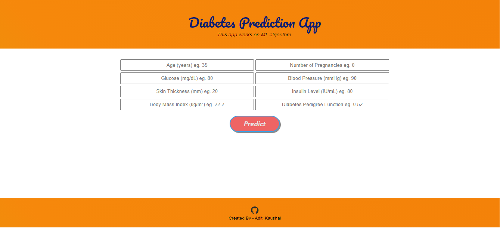

## Diabetes-Prediction-App
An app that predicts diabetes by using machine learning algorithm. It is built by Flask and deployed on Heroku.

In this project, our objective is to predict whether the patient has diabetes or not based on various features like *Pregnancies, Glucose, BloodPressure, SkinThickness, Insulin, BMI, Diabetes Pedigree Function, Age*. We will perform all the steps from *Data gathering to Model deployment.* During Model evaluation, we compare various machine learning algorithms on the basis of accuracy_score metric and find the best one. Then we create a web app using Flask which is a python micro framework.

> Deployment - https://daibetes-prediction-ap.herokuapp.com/

# **Screenshot**

# Installation

- Clone this repository and unzip it.

- After downloading, `cd` into the `flask` directory.

- Begin a new virtual environment with Python 3 and activate it.

- Install the required packages using 
   `pip install -r requirements.txt`

- Execute the command:
   `python app.py`

- Open the http link in your browser.
